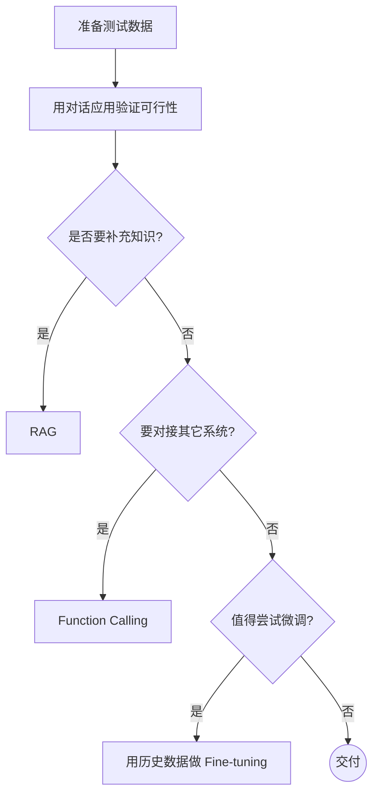

+++
title = 'Langchain'
date = 2025-10-23T15:41:01+08:00
draft = false
slug = "de862c4"
description = ""
summary = ""
tags = [ "技术", "开发" ]
categories = [ "tech" ]
cover = ""
author = "MapleScraps"

+++

# Langchain

##### LangChain 是用于构建基于大型语言模型（LLM）***应用程序*** 的开源框架（Framework）**  

---

##### LangChain 核心理念  
- **结构化** = 模块清晰 每个功能（ 如模型调用、记忆、工具、链条 ）都是独立模块，像积木一样  
- **易组合** = 像拼积木 不同模块可以自由组合，快速搭建复杂的应用  
- **易扩展** = 随时加新功能 可以很方便地接入新的模型、数据源或工具  

---

##### LangChain 框架主要核心模块：

1. **Models (模型)**：封装了与不同 LLM 提供商（如 OpenAI, HugingFace）的连接接口
2. **Prompts (提示词)**：提示词管理，构建，优化，序列化，然后发送给 LLM 的提示词的工具
3. **Chains (链)**：将多个 LLM 和 / 或其他组件连接在一起形成端到端的应用
4. **Retrieval (检索)**：用于从外部数据源（如向量数据库）获取相关文档，这是 RAG 的核心
5. **Agents (代理)**：决定模型通过哪个工具做出决策，采取哪些行动，执行 + 观察，直到任务完成
6. **Memory**：保存模型交互时上下文状态

-----

##### 大模型岗位
1. **大模型运维 / Infra 工程师**：算力资源层（ 算力 GPU ）
2. **数据开发工程师**：数据层（ 处理海量数据 ）
3. **大模型基座工程师**：通用大模型（ ChatGPT，Deepseek，通义 ）
4. **大模型应用开发工程师**：应用大模型层（ 基于特定领域大模型训练 ）
5. **大模型工程化工程师**：应用层工程化（ B端应用，C端应用，G端应用 结合企业现有的前后端调用大模型 ）

##### 解释：
- **B端 = 企业方**  
- **C端 = 用户方**  
- **G端 = 政府方**  

---



---

##### 大模型开发，如何开始？如何选择技术方案？下面是常用思路：

> [!NOTE] 注意： 其中最容易被忽略的，是准备测试数据

---

##### AI Agent 架构：

> **Agent = LLM + Memory + Tools + Planning + Action**

---

##### 什么是RAG：

> [!NOTE] 解释：
> 检索 --> 增强 --> 生成过程：  
> - **检索可以理解为第10步**  
> - **增强理解为第12步（ 这里的提示词包含检索到的数据 ）**  
> - **生成理解为第15步**  
---

##### 什么是RAG：

> [!NOTE] 这些过程中的难点：
> **1.** 文件解析  
> **2.** 文件切割  
> **3.** 知识检索  
> **4.** 知识重排序  
> 

---


##### 💦💦💦 以下示例是实现利用 langchain 和 云平台 AI 模型创建的生成式 AI

```py
from langchain.chains import ConversationChain
from langchain.memory import ConversationBufferMemory
from langchain_community.llms import Tongyi

# 创建一个内存记忆对象
memory = ConversationBufferMemory(return_message=True)

def get_respomse(prompt: str, api_key: str):
    model = Tongyi(model="qwen-max", api_key=api_key)
    chain = ConversationChain(llm=model, memory=memory)
    
    # 发送用户的请求
    response = chain.invoke({"input": prompt})
    return response["response"]

if __name__ == '__main__':
    print(get_response("请用Python输出1-10", api_key))
    
```


